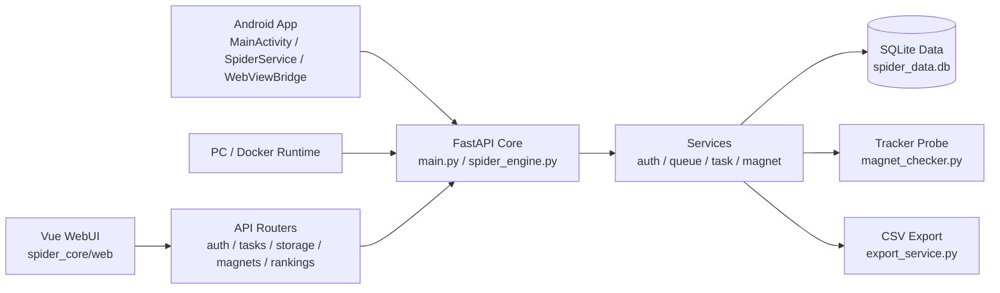

<div align="center">
  
  <h1>JavDB Magnet Spider</h1>
  <p>
    
    
    
    
  </p>
</div>

---

## 核心架构概述

本项目是跨平台 JavDB 自动化数据采集引擎，兼容 Docker、PC 桌面端与 Android 移动端。核心业务流覆盖端侧人机验证（CF WAF）穿透、守护进程静默采集、WebUI 远程任务调度与状态同步，支持按目标路由批量抓取并持久化数据。

## 核心特性

* **任务调度与实时事件**：`spider_engine.py` / `/api/v1/events` 提供内存队列、批量采集调度、SSE 实时进度与任务暂停、恢复、终止控制。
* **账号直登与登录态恢复**：`auth_browser_service.py` / `/api/auth/browser/*` 通过 `curl_cffi` 同出口直登并捕获 Cookie，无需浏览器、VNC 或额外容器；Cookie 失效时自动挂起至 `waiting_cookie` 并支持重新授权恢复。
* **排行榜与标签过滤**：`ranking_utils.py` / `/api/v1/rankings` 解析日/周/月榜、热播流与 TOP250；`useMovieTags.ts` 支持实体标签提取、交并差过滤及过滤结果导出。
* **Android 端侧运行**：`Chaquopy` / `WebViewBridge.java` 将 FastAPI 后端打包进 Android，并在端侧完成 WAF 质询拦截、Cookie 同步与 Python 引擎鉴权移交。
* **增量存储与断点恢复**：`db_store.py` / `spider_data.db` 基于 SQLite 做去重、游标记录、异常恢复与幂等持久化。
* **数据视图与导出**：`export_service.py` / `routers/storage.py` 提供集合与实体视图、候选磁力管理、优先级调整、CSV 导出和磁力链聚合复制。
* **收藏演员管理**：`actor_collection_repo.py` / `/api/v1/actors` 支持演员收藏看板、远端快照刷新、历史标签展开及聚合下发抓取任务。
* **磁力评估与自动降级**：`magnet_service.py` / `magnet_checker.py` / `/api/v1/storage/magnets/auto-select` 负责候选磁力评分、Tracker 探测、Active/Weak/Dead 状态回调、失败重试与首选链路自动切换。
* **Tracker 配置与网络穿透**：`settings_repo.py` / `curl_cffi` 支持自定义 Tracker 聚合，并通过浏览器 TLS 指纹与 JA3 特征提升 WAF 穿透稳定性。
* **WebUI 与应用安全**：`spider_core/web/src` 基于 Vue 3 + Vite 构建响应式控制台；`main.py` / `JAVDB_AUTH_TOKEN` 提供 Bearer 鉴权与导出路径边界保护。
* **局域网控制入口**：`SpiderService.java` / `0.0.0.0:8000` 允许 Android 后台服务开放局域网 HTTP 控制信令，实现无头化终端调度。

---

## 部署与初始化环境

### 方案一：Android 端部署与运行
1. **分发包安装**：从 [Releases] 渠道获取最新 APK 并完成安装。
2. **三阶段运行流程**：
   * **阶段 1：人机质询接管**：触发 `1. 手动登录过盾`。系统调用 `WebViewBridge` 容器发起鉴权会话，完成 CF 防护校验与用户认证后，导航至目标采集入口并提取 URI。关闭 WebView 时，后台进程自动捕获并持久化当前会话 Cookie。
   * **阶段 2：引擎守护进程拉起**：触发 `2. 启动爬虫引擎`。申请设备通知（Notification）与悬浮窗（System Alert Window）权限，维持后台 `SpiderService` 常驻。
   * **阶段 3：WebUI 控制台挂载**：触发 `3. 打开 WebUI`。浏览器加载本地端口 `127.0.0.1:8000`，通过前端下发采集指令至后端引擎。

### 方案二：Docker 容器化部署
推荐使用 Docker Compose 一键启动核心引擎：
```bash
# 获取 docker-compose.yml 与 .env.example
cp .env.example .env
# 在 .env 中配置 JAVDB_AUTH_TOKEN 等变量
docker-compose up -d
```
*监听网关：`http://NAS_IP:8090`*

也可通过 `docker run` 手动运行单容器：
```bash
docker run -d \
  --name=javdb-spider \
  -p 8090:8000 \
  -e JAVDB_AUTH_TOKEN=注入访问鉴权令牌 \
  -v /你的路径/appdata/javdb_spider/data:/app/data \
  --restart=unless-stopped \
  ghcr.io/siveci/javdb_spider:latest
```
*监听网关：`http://NAS_IP:8090`*

*注：JavDB Cookie 可在 WebUI → 设置 → “账号登录获取 Cookie” 中填入账号/密码/验证码获取。登录请求由本容器网络出口发出，**不同 IP 远程部署存在 CF 拦截风险，建议在局域网部署或本地运行时使用此功能**。*

**部署参数解析：**
* **API 鉴权注入**：Docker 镜像默认启用后端接口强制鉴权，需通过 `-e JAVDB_AUTH_TOKEN` 注入 Token，前端初始数据请求会校验该凭证。
* **存储卷挂载持久化**：需映射宿主机目录至 `/app/data`，确保 SQLite 实例（`spider_data.db`）与运行时配置文件脱离容器生命周期。

### 方案三：PC 端原生 Python 运行时部署
```bash
# 1. 初始化依赖环境
pip install -r requirements.txt

# 2. 挂载至核心工作区并启动服务进程
# (可选) 注入 JAVDB_AUTH_TOKEN 环境变量以激活 API 中间件拦截保护机制
cd spider_core
python -m uvicorn main:app --host 0.0.0.0 --port 8000 --no-access-log
```

*注：推荐在非故障诊断模式下开启 `--no-access-log`，过滤静态资源与心跳日志，降低标准输出（STDOUT）开销。*

### 前端开发与构建（Vue3 + Vite）

```bash
cd spider_core/web

# 开发模式（热更新）
npm install
npm run dev      # Vite dev server，代理 /api/ 到 127.0.0.1:8000

# 生产构建（输出到 spider_core/frontend_dist/，由 FastAPI 托管）
npm run build    # vue-tsc 类型检查 + vite build
```

> 注意：为保持仓库纯净，构建产物 `frontend_dist/` 已不再入库。PC 源码部署首次运行前需执行 `npm run build` 生成前端静态资源。
> Docker 与 Android 产物会在 CI/CD 流水线（`.github/workflows/`）中自动完成前端编译，可直接下载发行版使用。

---

## 核心操作与链路调用指南

### 1. 采集链路参数配置
* **入口 URI 定位**：在目标前端视图中筛选业务标签（如“单体”、“高清”），提取浏览器地址栏完整 URI 参数作为基础抓取路由；也支持由 WebUI 基于本地资源库渲染动态过滤条件。
  * **Android 运行环境**：必须在第一阶段的系统内置 WebView 中捕获目标 URI，并在后端直连的 WebUI 实例中提交。严禁经外部第三方浏览器中转，避免 Cookie 校验失效导致连接阻断。
* **请求头注入（Cookie & User-Agent）**：
  * **Android 运行环境**：系统引擎底层自动挂钩并同步当前 WebView 活动会话池。
  * **PC / Docker 运行环境**：在 WebUI 设置页或任务面板点击 **“账号登录获取 Cookie”**，填入账号、密码和验证码即可直登，并自动捕获 Cookie 与 User-Agent；手动粘贴输入框仍作为兜底。
* **前端会话控制**：Web 控制台注入或直登获取的 Cookie 默认映射于前端内存。勾选会话保持后，凭据会序列化写入本地数据库与浏览器沙盒缓存。

### 2. 链路探测与资源降级演练
数据采集批次结束后，可通过内置协议嗅探器校验磁力关联资源存活状态。

#### 探测作用域路由控制
* **实体级嗅探（Entity Level）**：在当前实体下展开候选磁力，依赖单实体探测 API (`/api/v1/magnets/check`) 触发 P2P 健康校验。
* **集合级嗅探（Collection Level）**：遍历指定集合，将关联列表投递至探测队列执行并发监测。
* **全局域嗅探（Global Level）**：借助 DAO 层（`db_store.py`）扫描全量库候选磁力数据并抛送至探测器。
* **差量容错处理（Delta Retry）**：将上一轮标记为 `失败`（Error）的非稳态链接重新调度并补发探测请求。

#### 协议状态量化定义与调度回调

| 标识 | 状态 | 判定依据 | 调度含义 |
| :---: | :--- | :--- | :--- |
| 🟢 | **活跃（Active）** | 命中做种终端（Seeders）反馈 | 资源高优可用 |
| 🟡 | **衰退（Weak）** | 未命中做种响应，但观测到下载端（Leechers）广播 | 可用态势受限 |
| 🔴 | **失效（Dead）** | P2P 寻址未收到做种端与下载端反馈 | 资源无法连通 |
| ⚪ | **挂起（Pending）** | 子模块尚未下发调度事件 | 保持默认等待状态 |
| ❌ | **异常（Error）** | 网络超时或协议解析异常（Exception） | 进入失败重试候选 |

#### 资源优先级自动清洗算法
通过数据控制层入口（面板 ★ 图标按钮）触发自动降级回调，链路管理服务（`magnet_service`）会按嗅探报告批量调整优先级权重：
* **稳态链路（Active / Weak）**：保留原始启发式评分，不作削减。
* **离线链路（Dead / Error）**：注入全局惩罚因子（默认 -200 扣分），通过评分衰减排序强制落选，并将目标对象重新锚定至次优可用资源。

#### 复合型 Tracker 请求源融合管理
配置映射中心（Config DAO）提供 Tracker 注入配置。嗅探模块（`magnet_checker.py`）构造测试请求包时会动态聚合三类地址：
1. 磁力链路（URI）自身的内联数据流（dn 与 tr 键值）。
2. 持久化实例（`settings_repo.py`）维护的用户显式注入数据字典。
3. 框架预设的公共网关保底链路组。

### 3. 移动端进程防杀与保活模型 (Android)
为对抗 Android 对底层 `SpiderService` 脱机服务的资源回收调度（OOM-Killer & Doze-Mode），建议实施以下平台级保活配置：
* **抢占系统级弹窗权限（System Alert Window）**：申请悬浮窗口（Overlay）权限作为挂载系统视图层的前置条件，并提高目标应用在 Activity Manager Service (AMS) 内存评级中的优先级。
* **电池白名单隔离（Battery Optimization Bypass）**：进入设备设置 -> 应用程序详情 -> 电量管控，将耗电控制调整为完全无限制（Unrestricted），避免待机睡眠中断网络及 I/O 请求。
* **强制内存锁定挂载（Task Lock）**：在系统任务总控（Recents Tasks View）中对宿主包设置锁定标记，阻止资源紧张时的强制淘汰。

---

## 核心架构图谱



<details>
<summary>展开完整目录结构</summary>

```text
├── app/                        # Android Client (Java Native / UI / WebKit)
│   ├── src/
│   │   ├── main/
│   │   │   ├── AndroidManifest.xml     # Android App Manifest
│   │   │   ├── java/com/javdb_spider/app/
│   │   │   │   ├── MainActivity.java   # Android App Entrypoint & Permissions
│   │   │   │   ├── SpiderService.java  # Foreground Daemon Service for Chaquopy
│   │   │   │   └── WebViewBridge.java  # WebView Hook for CF WAF Bypass & Cookie Sync
│   │   │   └── res/                    # Android Resources (Layouts, Icons, Strings)
│   │   ├── androidTest/               # Android Instrumentation Tests
│   │   └── test/                       # Android Unit Tests
├── spider_core/                # Backend Core Engine (FastAPI Runtime)
│   ├── main.py                 # ASGI Entrypoint & Middleware (CORS / Auth Interceptor)
│   ├── app_config.py           # Centralized Application Configuration & Constants
│   ├── dependencies.py         # FastAPI Dependency Injection & Request Scoping
│   ├── schemas.py              # Pydantic Data Models & Type Definitions
│   ├── utils.py                # Core Utilities & Helper Functions
│   ├── spider_engine.py        # Task Orchestration & Concurrent Scraping Engine
│   ├── ranking_utils.py        # HTML/JSON Parsing & Ranking Data Binding
│   ├── magnet_checker.py       # P2P Tracker Probing Module (UDP/HTTP Client)
│   ├── movie_repo.py           # Movie Entity DAO
│   ├── task_repo.py            # Task Queue & State Machine DAO
│   ├── settings_repo.py        # Config Serialization & Caching DAO
│   ├── db_store.py             # SQLite Connection Pool & Transaction Manager
│   ├── export_service.py       # Entity-to-CSV Serialization Service
│   ├── storage_utils.py        # Storage Path & Security Utilities
│   ├── routers/                # API Routing Layer
│   │   ├── auth_browser.py     # Auth Login API Routes
│   │   ├── magnets.py          # Magnet Health & Priority Routes
│   │   ├── movies.py           # Movie Entity & Tag Filtering Routes
│   │   ├── rankings.py         # Ranking & Top250 Routes
│   │   ├── settings.py         # System Configuration Routes
│   │   ├── storage.py          # Storage Management & CSV Export Routes
│   │   └── tasks.py            # Spider Task Queue Control Routes
│   ├── services/               # Business Logic Layer
│   │   ├── auth_browser_service.py # Direct Login (curl_cffi) Service
│   │   ├── cookie_validation_service.py # Cookie Health Check & Validation
│   │   ├── magnet_service.py   # Magnet Selection & Scoring Algorithms
│   │   ├── queue_service.py    # Background Queue & Thread Management
│   │   └── task_service.py     # Task Preparation & Payload Serialization
│   ├── web/                    # Vue3+Vite 前端源码（重写后）
│   │   ├── src/                # Vue SFC 源码
│   │   │   ├── views/          # 页面级组件（Tasks/Database/Actors/Settings）
│   │   │   ├── stores/         # Pinia 状态（auth/tasks/settings/actors/database）
│   │   │   ├── composables/    # 复用逻辑（useToast/useTheme/useClipboard）
│   │   │   ├── api/            # apiFetch 封装
│   │   │   ├── router/         # Vue Router（hash 模式）
│   │   │   └── types/          # 对照后端 schemas.py 的 TS 类型
│   │   ├── package.json
│   │   └── vite.config.ts      # build.outDir → ../frontend_dist
│   ├── frontend_dist/          # Vite 构建产物（在 CI/CD 或本地手动构建，不再入库）
│   │   ├── index.html          # 单页入口（FastAPI 托管）
│   │   └── assets/             # JS/CSS（FastAPI 挂载 /assets）
│   ├── tests/                  # Python Unit Test Suite
│   │   ├── test_api_endpoints.py
│   │   ├── test_magnet_checker.py
│   │   ├── test_movie_tags.py
│   │   ├── test_rankings.py
│   │   ├── test_spider_engine.py
│   │   ├── test_v13_security.py
│   │   ├── test_v14_db_store.py
│   │   ├── test_v15_tasks.py
│   │   └── test_v16_queue_runtime.py
│   └── data/                   # Local Persistent Data Volume
│       ├── spider_data.db      # SQLite Database File
│       ├── checkpoint.json     # Scraping State Snapshot
│       └── status.json         # Runtime Status Metrics
├── docker-compose.yml          # Container Orchestration Config
├── Dockerfile                  # OCI Container Build Script
├── build.gradle                # Root Gradle Build Configuration
├── gradle/                     # Gradle Wrapper & Version Catalog
│   └── libs.versions.toml      # Dependency Version Catalog
└── requirements.txt            # Python Package Dependencies
```

</details>

---

## 系统边界约束与依赖项

| 部署基线 | 兼容性边界范围 |
| :--- | :--- |
| **Android 容器层** | API Level 26+ (Android 8.0+，推荐 API 30+)；强制匹配 `arm64-v8a` 处理器指令集。 |
| **OCI 容器体系 (Docker)** | 原生镜像兼容 `linux/amd64` 与 `linux/arm64` 执行端。 |
| **Python 后端运行时** | 运行时依赖版本要求 `>= 3.12.x`，用于适配类型提示与核心模块解析环境。 |

---

## 合规限制与免责声明

1. **研发边界控制限制**：本仓库用于论证 Python 数据层抓取与 Chaquopy Android 原生环境混合桥接架构。严禁在违反所在地网络合规政策的前提下，将其用于主观恶意或违法的信息探测业务。
2. **抓取并发与链路阻断控制**：发起并发数据采集时，责任主体应遵守目标源服务器 `robots.txt` 指引并设置轮询缓冲，避免以高强度连接池触发服务端分布式拒绝服务式（DoS）冲刷。
3. **零隐私探针（Telemetry-Free）审计宣告**：系统运行于本地离线沙箱，不内嵌外部状态回送或数据上报钩子。授权凭据（Cookie）与平台拦截特征码仅在客户端向目标集群单向传递；维护者不对越权利用及 Cookie Leakage 问题提供担保。
