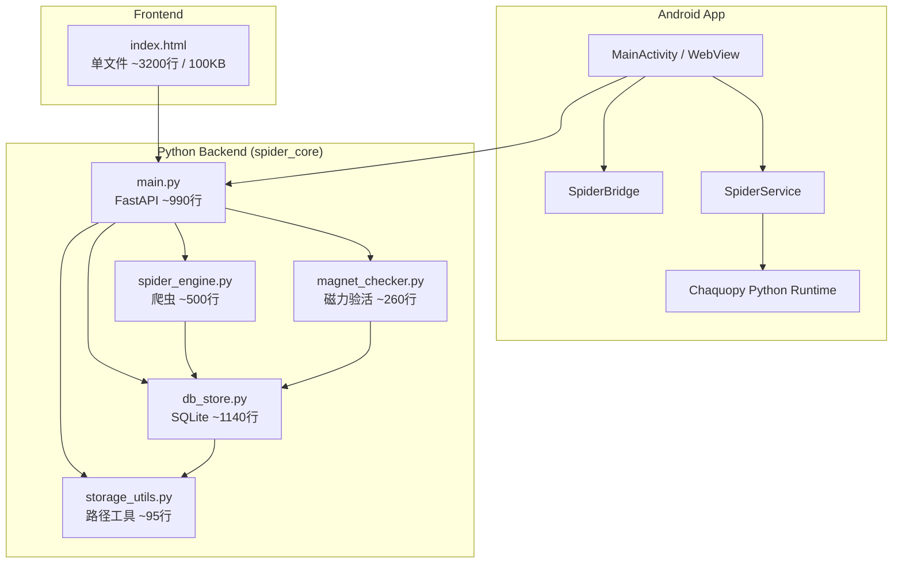
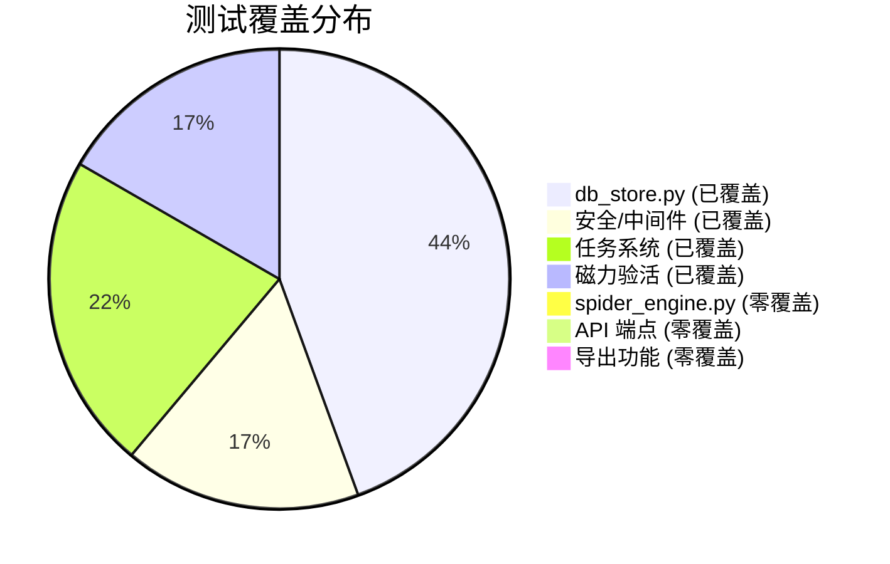

# JavDB Magnet Spider — 项目代码分析与重构建议

## 项目概览

本项目是一个 JavDB 磁力链接爬虫，包含三个运行目标：PC（本地 Python）、Docker 容器、Android APK。



| 模块 | 文件数 | 总行数 | 职责 |
|------|--------|--------|------|
| Python 后端 | 5 | ~3,328 行 | API 路由、爬虫引擎、数据库、磁力验活、路径工具 |
| 前端 WebUI | 1 | ~1,764 行 / 100KB | 任务管理、影片浏览、磁力验活、系统设置 |
| Android 壳 | 3 Java | ~543 行 | WebView 容器、JS Bridge、后台服务 |
| 测试 | 6 | ~1,007 行 | 数据库、安全、任务、磁力验活测试 |

---

## 🔴 关键问题（Critical — 建议优先处理）

### 1. 前端 `index.html` 单文件 100KB 巨石

> [!CAUTION]
> **严重性：Critical** — 这是项目中最大的技术债务

**现状：**
- HTML 结构（~200 行）+ Tailwind CDN + JS（~1,550 行），全部写在一个文件中
- 文件大小 100KB，约 1,764 行，**~75 个全局函数**
- **25 个全局可变状态变量**（如 `tasksCache`, `collectionsCache`, `expandedMovieId` 等）
- ~25 处重复的 `fetch()` API 调用模式，错误处理全部使用 `window.alert()` 阻塞 UI
- 大量 HTML 字符串拼接构建 DOM（`renderMagnetCheckButton()` 57行、`renderCollections()` 32行、`renderMagnetRow()` 22行）
- 内联事件处理 `onclick="fn()"` + `escapeJs()` 手动转义（极脆弱的 XSS 防护）
- **`loadMagnets()` 函数存在 33 行死代码**（`return` 之后的代码永远不会执行）
- 使用 **Tailwind CDN（JIT 模式）**，生产环境加载 ~300KB+ JS 编译器

**影响：**
- 无法独立修改样式/逻辑/结构，多人协作困难
- 无法进行前端单元测试
- `setInterval` 轮询无 try/catch，一次网络错误可导致轮询永久静默失败
- 每次轮询都全量 `innerHTML` 重建 DOM，大数据集下性能堪忧
- `escapeHtml()` / `escapeJs()` 需手动调用，遗漏即 XSS

**重构思路：**

```
spider_core/frontend/
├── index.html              # 仅保留骨架 HTML
├── css/
│   ├── variables.css       # CSS 自定义属性 / 主题
│   ├── base.css            # 基础样式 / Reset
│   ├── components.css      # 通用组件（按钮、卡片、表格、Modal）
│   └── pages.css           # 各 Tab 页面特有样式
├── js/
│   ├── app.js              # 入口：初始化、Tab 切换、主题
│   ├── api.js              # 统一 API 客户端（封装 fetch + 错误处理）
│   ├── state.js            # 集中状态管理
│   ├── tasks.js            # 任务管理模块
│   ├── movies.js           # 影片数据模块
│   ├── magnets.js          # 磁力验活模块
│   ├── settings.js         # 系统设置模块
│   └── utils.js            # 工具函数（toast、格式化、确认框）
└── favicon.png / logo.png
```

同时在 FastAPI 中配置 `StaticFiles` 挂载整个 `frontend/` 目录。

> [!WARNING]
> 前端还有一个 **立即可修的 bug**：[index.html](file:///home/siveci/workspace/JavDB_magnet_Spider/spider_core/frontend/index.html) 中 `loadMagnets()` 函数在 `return magnets;` 之后有 ~33 行死代码（来自旧版重构残留），应立即删除。

---

### 2. 后端 `DBStore` God Class（60+ 方法，1,140 行）

> [!CAUTION]
> **严重性：Critical** — 单一类承担了过多职责

**现状：**
- `DBStore` 类包含 **~60 个方法**，覆盖了：schema 创建/迁移、5 张表的 CRUD、搜索/过滤、CSV/JSON 导出、数据库维护
- 动态 SQL 拼接散落在多个方法中
- 导出逻辑（CSV/JSON ~130 行）属于展示层而非存储层

**具体重复代码：**
- `get_movie_magnets()` 与 `get_movie_magnet_rows()` — **100% 相同的函数**，返回完全一样的数据
- `_normalize_tags()` 与 `_normalize_trackers()` — 逻辑完全相同（去重字符串列表）
- `_tags_to_json()` / `_tags_from_json()` 与 `_trackers_to_json()` / `_trackers_from_json()` — 同样的重复
- `select_movie_magnet()` 与 `_reselect_movie_magnet()` — 大部分 UPDATE 逻辑重复

**重构思路：**

```python
# 拆分为职责单一的模块
spider_core/
├── db_store.py         # 精简为：连接管理、Schema、迁移（~200行）
├── movie_repo.py       # Movie/Magnet 的 CRUD + 搜索（~300行）
├── task_repo.py        # Task 的 CRUD + 状态机（~200行）
├── settings_repo.py    # Settings 的 CRUD（~100行）
├── export_service.py   # CSV/JSON 导出（~150行）
```

各 Repo 类接收 `DBStore` 实例（或连接工厂）作为依赖注入。
同时立即合并重复函数：删除 `get_movie_magnet_rows()`，统一 `_normalize_*` 为 `_normalize_string_list()`。

---

## 🟠 重要问题（High — 建议近期处理）

### 3. `main.py` 路由文件过度膨胀（~1,073 行）

**现状：**
- **32 个 HTTP 端点** + 任务队列管理 + 认证中间件，全部在一个文件
- 端点处理函数包含业务逻辑（40-80 行/个）
- 任务队列（全局 `QUEUE_THREAD` + `QUEUE_LOCK`）与路由混在一起
- **重复的磁力检查端点模板**：`check_movie_magnets`、`check_collection_magnets`、`check_all_magnets` 三个端点有 ~15 行完全相同的逻辑，重复了 3 次
- **遗留 API 与 RESTful API 并存**：`POST /api/start` 与 `POST /api/tasks` 做的是同一件事；`POST /api/stop` 与 `POST /api/tasks/{id}/pause` 语义重叠
- **HTTP 响应模式不一致**：部分端点返回 `JSONResponse(status_code=400)`，部分返回 HTTP 200 + `{"code": 400}`

**重构思路：**

```python
spider_core/
├── main.py             # 精简为：app 创建、中间件、lifespan、路由注册（~100行）
├── routers/
│   ├── tasks.py        # 任务相关端点
│   ├── movies.py       # 影片相关端点
│   ├── magnets.py      # 磁力验活端点
│   ├── settings.py     # 设置端点
│   └── storage.py      # 存储管理端点
├── services/
│   ├── task_service.py # 任务编排、队列管理、worker
│   └── crawl_service.py # 爬取参数校验和调度
├── utils/
│   └── sse.py          # SSE 流复用工具
```

使用 FastAPI 的 `APIRouter` 进行路由拆分。

---

### 4. 爬虫引擎零测试覆盖 + `run_spider()` 巨型函数

**现状：**
- `spider_engine.py` 的 HTML 解析是整个系统最脆弱的部分，**零测试覆盖**
- `run_spider()` 是整个代码库中最长的函数：**203 行**（lines 224-426），包含参数校验、checkpoint 恢复、Phase 1 列表爬取（含分页）、动态文件名推断、模式冲突检测、Phase 2 详情页爬取（含磁力提取）、增量跳过逻辑、最终状态更新
- 存在 **裸 `except:`**（line 118）— 连 `KeyboardInterrupt` 都会被吞掉
- `db_store.configure()` 被调用两次：`spider_engine.py` 导入时一次，`main.py` 模块级别又一次（潜在的初始化顺序 Bug）
- 双重状态追踪：`update_status()` 每次同时写 DB 和 JSON 文件（遗留冗余）

**重构思路：**
- **分解 `run_spider()`**：拆为 `_crawl_listing_pages()` (Phase 1) + `_crawl_detail_pages()` (Phase 2) + `_infer_filename()`
- **修复裸 `except:`**：改为 `except (json.JSONDecodeError, KeyError, OSError):`
- **去除重复初始化**：只在 `main.py` 的 lifespan 中调用一次 `db_store.configure()`
- 保存 JavDB 页面 HTML 作为 fixture，编写 `test_spider_engine.py`
- 将 CSS 选择器提取为常量，便于页面结构变更时快速定位修改点

---

### 5. 前端 XSS 防护机制脆弱

**现状：**
- 项目已有 `escapeHtml()` 和 `escapeJs()` 函数，但需要**手动调用**
- `escapeJs()` 使用 HTML 实体编码 + 反斜杠转义的混合方案，仅在 `onclick="fn('...')"` 上下文中有效（先经过 HTML 实体解码，再经过 JS 字符串解析），极其脆弱
- ~75 个全局函数中任何一处遗漏调用即产生 XSS 漏洞
- 所有用户反馈使用 `window.alert()`（~20 处），阻塞整个 UI 线程包括轮询

**重构思路：**
- 将 `alert()` 替换为 Toast/Snackbar 组件，不阻塞 UI
- 使用 `<template>` + `cloneNode()` + DOM API 设置 `textContent` 替代字符串拼接
- 或引入轻量级模板引擎，从架构层面消除手动转义的需要

---

### 6. 前端重复的 API 调用模式（~25 处）

**现状：**
```javascript
// 此模式在代码中重复 ~25 次
fetch('/api/xxx')
  .then(r => r.json())
  .then(data => { /* 处理 */ })
  .catch(err => showToast('错误: ' + err.message));
```

**重构思路：**
```javascript
// 抽取统一 API 客户端
const api = {
  async get(url, params = {}) {
    const query = new URLSearchParams(params).toString();
    const resp = await fetch(query ? `${url}?${query}` : url);
    if (!resp.ok) throw new Error(`${resp.status}: ${resp.statusText}`);
    return resp.json();
  },
  async post(url, body) { /* ... */ },
  async delete(url) { /* ... */ }
};
```

---

## 🟡 中等问题（Medium — 可安排迭代处理）

### 7. `spider_engine.py` 中 `parse_movie_detail()` 过长（~120 行）

**现状：** 单个函数解析 15+ 字段，包括标题、番号、日期、封面、演员、标签、磁力链接。

**重构思路：** 拆分为子解析器：
```python
def parse_movie_detail(html):
    soup = BeautifulSoup(html, 'lxml')
    movie = {}
    movie.update(_parse_meta(soup))      # 标题、番号、日期
    movie['magnets'] = _parse_magnets(soup)
    movie['actors'] = _parse_actors(soup)
    movie['tags'] = _parse_tags(soup)
    movie['cover'] = _parse_cover(soup)
    return movie
```

---

### 8. 后端缺少统一异常体系

**现状：**
- `main.py` 用 `HTTPException`
- `spider_engine.py` 用 `try/except Exception` 全捕获
- `db_store.py` 有时返回 `None` 表示失败，有时直接抛异常

**重构思路：**
```python
# exceptions.py
class SpiderBaseError(Exception): pass
class CrawlError(SpiderBaseError): pass
class StorageError(SpiderBaseError): pass
class ValidationError(SpiderBaseError): pass
class ExportError(SpiderBaseError): pass
```
配合 FastAPI 的 `exception_handler` 统一转换为 HTTP 响应。

---

### 9. Android 端多项标准实践缺失

**现状：**
- `MainActivity`（~205 行）+ `SpiderService`（~275 行）+ `WebViewBridge`（~63 行）
- 无 ViewModel / LiveData，无架构模式
- `WebViewBridge.activeService` 是 **非 volatile 的静态可变字段**，从后台线程读取，主线程写入，存在可见性问题
- `visibleWebView` 无生命周期管理（未在 `onPause()` / `onDestroy()` 中暂停/销毁），**导致内存泄漏**
- `SpiderService` 在**主线程执行文件 I/O**（`updateNotificationFromJson()` 读取 `status.json`），可能导致 ANR
- Python 后端在裸 `Thread` 中启动，崩溃后**服务变成僵尸**（无重启机制、无用户通知）
- 使用已废弃的 `startActivityForResult()` 和 `shouldOverrideUrlLoading(WebView, String)`
- 无返回键处理：登录界面可见时按返回直接退出应用
- **`app/build.gradle` 中明文存储签名密码** `storePassword "123456"`（违反 AGENTS.md 安全规则）
- Notification 无点击 `PendingIntent`，点击通知无响应
- 声明了 `WAKE_LOCK` 权限但从未使用

**重构思路：**
- **立即修复**：移除 `build.gradle` 中的签名密码，改用 `local.properties`
- **立即修复**：`WebViewBridge.activeService` 添加 `volatile` 关键字
- 添加 `onPause()` / `onResume()` / `onDestroy()` 生命周期管理
- 将 `updateNotificationFromJson()` 移到后台线程
- 为 Python 启动线程设置 `UncaughtExceptionHandler` + 重启机制
- 引入 `ActivityResultLauncher` 替代已废弃 API

---

### 10. 全局状态管理混乱（前端）

**现状：** ~15 个顶级 `let` 变量分散管理状态，状态变更散落在各函数中。

**重构思路：**
```javascript
const AppState = {
  currentTab: 'tasks',
  tasks: { list: [], activeId: null, polling: null },
  movies: { list: [], page: 1, total: 0, filters: {} },
  magnets: { checking: false, polling: null, history: [] },
  settings: {},
  
  update(path, value) {
    // 集中管理状态变更
  }
};
```

---

## 🟢 低优先级问题（Low — 有空时改善）

| # | 问题 | 位置 | 建议 |
|---|------|------|------|
| 11 | 缺少类型注解 | 后端所有文件 | 逐步添加，从 `db_store.py` 和 `main.py` 的公开 API 开始 |
| 12 | 魔法数字/硬编码 | 后端 `-200` 分数惩罚、`80` 日志上限；前端轮询间隔 | 提取为命名常量 |
| 13 | 无 API 级集成测试 | `spider_core/tests/` | 使用 FastAPI `TestClient` 添加端点测试 |
| 14 | Tailwind CDN 用于生产 | `index.html` 加载 ~300KB JIT 编译器 | 改用 Tailwind CLI 构建生产 CSS |
| 15 | 版本号不同步 | Dockerfile `1.6.0` vs `main.py` `1.7.0` | 统一为单一版本来源 |
| 16 | 简单的速率限制 | `spider_engine.py` | 添加自适应退避机制 |
| 17 | 硬编码 Tracker 列表 | `magnet_checker.py` | 改为通过设置页面可配置 |
| 18 | Android 硬编码服务器 URL | 多处 `http://127.0.0.1:8000` | 提取为 `BuildConfig` 常量 |
| 19 | `requirements.txt` 无版本锁定 | 项目根目录 | 至少锁定主版本号，防止上游破坏性变更 |
| 20 | 冗余的 `json` 导入 | `db_store.py` 顶部 + 函数内再次导入 | 删除函数内重复导入 |
| 21 | Android 布局全部硬编码颜色和中文 | `activity_main.xml` | 移至 `colors.xml` + `strings.xml` |

---

## 测试覆盖现状



| 测试文件 | 覆盖模块 | 测试数 |
|---------|---------|-------|
| [test_v14_db_store.py](file:///home/siveci/workspace/JavDB_magnet_Spider/spider_core/tests/test_v14_db_store.py) | 数据库 CRUD、Schema、迁移 | 18 |
| [test_v16_queue_runtime.py](file:///home/siveci/workspace/JavDB_magnet_Spider/spider_core/tests/test_v16_queue_runtime.py) | 队列管理、任务恢复 | 10 |
| [test_v15_tasks.py](file:///home/siveci/workspace/JavDB_magnet_Spider/spider_core/tests/test_v15_tasks.py) | 任务状态机 | 9 |
| [test_v13_security.py](file:///home/siveci/workspace/JavDB_magnet_Spider/spider_core/tests/test_v13_security.py) | 认证、路径遍历防护 | 8 |
| [test_magnet_checker.py](file:///home/siveci/workspace/JavDB_magnet_Spider/spider_core/tests/test_magnet_checker.py) | 磁力 URI 解析 | 7 |
| [test_movie_tags.py](file:///home/siveci/workspace/JavDB_magnet_Spider/spider_core/tests/test_movie_tags.py) | 标签存储 | 4 |

**关键缺失：**
- ❌ `spider_engine.py` 的 `run_spider()`（203 行）、`evaluate_magnet()`、`parse_size()` — 零覆盖
- ❌ `main.py` API 端点 — 无 `TestClient` 集成测试
- ❌ 导出功能 — CSV/JSON 生成未测试，`exclude_tags` 过滤未测试
- ❌ 队列 Worker 线程生命周期 — 未测试
- ❌ 磁力检查任务取消流程 — 未测试
- ❌ `db_store.update_task_cookie()` — 仅通过 API 端点间接测试

---

## 推荐重构路线图

> [!IMPORTANT]
> 建议按阶段执行，每个阶段独立可交付、可验证。

### Phase 0 — 立即修复（< 1 小时，消除风险）
1. ~~删除~~ `loadMagnets()` 中 33 行死代码
2. 移除 `build.gradle` 中明文签名密码，改用 `local.properties`
3. 修复 `spider_engine.py` 裸 `except:` 为 `except (json.JSONDecodeError, KeyError, OSError):`
4. `WebViewBridge.activeService` 添加 `volatile`
5. 删除重复函数 `get_movie_magnet_rows()`（与 `get_movie_magnets()` 100% 相同）
6. 合并 `_normalize_tags()` / `_normalize_trackers()` 为 `_normalize_string_list()`

### Phase 1 — 前端拆分（影响最大，风险可控）
1. 将 JS 拆分为模块（`api.js`、`state.js`、功能模块），消除 75 个全局函数
2. 替换 `alert()` 为 Toast 组件
3. `setInterval` 改为 `setTimeout` 链 + try/catch，防止请求堆积
4. FastAPI 配置 StaticFiles 挂载

### Phase 2 — 后端分层（降低维护成本）
1. 拆分 `DBStore` 为 Repo 模块
2. 拆分 `main.py` 为 Router + Service（使用 `APIRouter`）
3. 统一 HTTP 响应模式（选定 `JSONResponse(status_code=X)` 或 `{"code": X}`，不要混用）
4. 合并 3 个重复的磁力检查端点模板为一个 helper
5. 清理遗留 API（`/api/start`、`/api/stop`、`/api/resume`）

### Phase 3 — 测试补全（保护核心逻辑）
1. 添加 `spider_engine.py` 的解析测试（保存 HTML fixture）
2. 添加 API 端点集成测试（`TestClient`）
3. 添加导出功能 + `exclude_tags` 测试

### Phase 4 — Android 改善（可选）
1. 添加 WebView 生命周期管理（修复内存泄漏）
2. `updateNotificationFromJson()` 移到后台线程
3. Python 启动线程添加异常处理 + 重启机制
4. 替换已废弃 API（`startActivityForResult` → `ActivityResultLauncher`）

---

## 亮点（做得好的部分）

值得肯定的是，项目在以下方面做得不错：

- ✅ **`storage_utils.py`** 设计精简、职责单一，是项目中最干净的模块
- ✅ **`magnet_checker.py`** 结构清晰，函数大小合理，有自定义异常层次（`MagnetCheckError`、`InvalidMagnetError`）
- ✅ **SQL 参数化查询** — 值传递使用了参数化（`?` 占位符），而非拼接，有效防止 SQL 注入
- ✅ **SQLite WAL 模式** + `busy_timeout` 处理并发，外键 ON DELETE CASCADE 保持一致性
- ✅ **测试使用 `TemporaryDirectory`** 隔离，不污染环境，测试/源码比 30%
- ✅ **Schema 版本化迁移** — 有正式的版本管理机制
- ✅ **认证中间件** — Token 保护和路径遍历防护都有测试覆盖
- ✅ **Android `SpiderService`** 中隐身 WebView + `CountDownLatch` 的设计巧妙，双超时机制的竞态处理正确
- ✅ **前端已有 `escapeHtml()` / `escapeJs()`** 转义函数，以及 `apiFetch()` 统一的 401 处理
